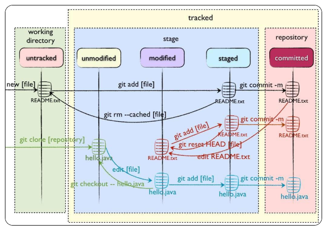

## 工作区、暂存区、版本库、远程仓库

Git和其他版本控制系统如SVN的一个不同之处就是有暂存区的概念

Git本地有四个工作区域：工作目录（Working Directory）、暂存区(Stage/Index)、资源库(Repository或Git Directory)、git仓库(Remote Directory)。文件在这四个区域之间的转换关系如下：


* Workspace： 工作区，就是你平时存放项目代码的地方
* Index / Stage： 暂存区，用于临时存放你的改动，事实上它只是一个文件，保存即将提交到文件列表信息
* Repository： 仓库区（或版本库），就是安全存放数据的位置，这里面有你提交到所有版本的数据。其中HEAD指向最新放入仓库的版本
* Remote： 远程仓库，托管代码的服务器，可以简单的认为是你项目组中的一台电脑用于远程数据交换

### 工作流程
git的工作流程一般是这样的：

１、在工作目录中添加、修改文件；

２、将需要进行版本管理的文件放入暂存区域；

３、将暂存区域的文件提交到git仓库。

因此，git管理的文件有三种状态：**已修改（modified）,已暂存（staged）,已提交(committed)**

### 文件的四种状态
版本控制就是对文件的版本控制，要对文件进行修改、提交等操作，首先要知道文件当前在什么状态，不然可能会提交了现在还不想提交的文件，或者要提交的文件没提交上。

GIT不关心文件两个版本之间的具体差别，而是关心文件的整体是否有改变，若文件被改变，在添加提交时就生成文件新版本的快照，而判断文件整体是否改变的方法就是用

* Untracked:   未跟踪, 此文件在文件夹中, 但并没有加入到git库, 不参与版本控制. 通过git add 状态变为Staged.

* Unmodify:   文件已经入库, 未修改, 即版本库中的文件快照内容与文件夹中完全一致. 这种类型的文件有两种去处, 如果它被修改, 而变为Modified.如果使用git rm移出版本库, 则成为Untracked文件

* Modified: 文件已修改, 仅仅是修改, 并没有进行其他的操作. 这个文件也有两个去处, 通过git add可进入暂存staged状态, 使用git checkout 则丢弃修改过,返回到unmodify状态, 这个git checkout即从库中取出文件, 覆盖当前修改

* Staged: 暂存状态. 执行git commit则将修改同步到库中, 这时库中的文件和本地文件又变为一致, 文件为Unmodify状态. 执行git reset HEAD filename取消暂存,文件状态为Modified

下面的图很好的解释了这四种状态的转变：



> 新建文件--->Untracked
>
> 使用add命令将新建的文件加入到暂存区--->Staged
>
> 使用commit命令将暂存区的文件提交到本地仓库--->Unmodified
> 
> 如果对Unmodified状态的文件进行修改---> modified
> 
> 如果对Unmodified状态的文件进行remove操作--->Untracked

## 四个区域常用命令

### 1、新建代码库
```sh
# 在当前目录新建一个Git代码库
 git init
# 新建一个目录，将其初始化为Git代码库
git init [project-name]
# 下载一个项目和它的整个代码历史
git clone [url]
```
### 2、查看文件状态
```sh
#查看指定文件状态
git status [filename]
#查看所有文件状态
git status
```
### 3、工作区<-->暂存区
```sh
# 添加指定文件到暂存区
git add [file1] [file2] ...
# 添加指定目录到暂存区，包括子目录
git add [dir]
# 添加当前目录的所有文件到暂存区
git add .
#当我们需要删除暂存区或分支上的文件, 同时工作区也不需要这个文件了, 可以使用（⚠️）
git rm file_path
#当我们需要删除暂存区或分支上的文件, 但本地又需要使用, 这个时候直接push那边这个文件就没有，如果push之前重新add那么还是会有。
git rm --cached file_path
#直接加文件名   从暂存区将文件恢复到工作区，如果工作区已经有该文件，则会选择覆盖
#加了【分支名】 +文件名  则表示从分支名为所写的分支名中拉取文件 并覆盖工作区里的文件
git checkout
```
###  4、工作区<-->资源库（版本库）
```sh
#将暂存区-->资源库（版本库）
git commit -m '该次提交说明'
#移除不必要的添加到暂存区的文件
git reset  --hard HEAD 文件名
#去掉上一次的提交（会直接变成add之前状态）
git reset  --hard HEAD^ 
#去掉上一次的提交（变成add之后，commit之前状态）  
git reset --soft  HEAD^ 
```
:::tip
用HEAD表示当前版本，上一个版本就是HEAD^，上上一个版本就是HEAD^^，当然往上100个版本写100个^比较容易数不过来，所以写成HEAD~100

reset --soft 会在重置 HEAD 和 branch 时，保留工作目录和暂存区中的内容，并把重置 HEAD 所带来的新的差异放进暂存区。
:::
### 5、远程操作
```sh
# 取回远程仓库的变化，并与本地分支合并
git pull
# 上传本地指定分支到远程仓库
git push
```
### 6、其它常用命令
```sh
# 显示当前的Git配置
git config --list
# 编辑Git配置文件
git config -e [--global]
#初次commit之前，需要配置用户邮箱及用户名，使用以下命令：
git config --global user.email "you@example.com"
git config --global user.name "Your Name"
#调出Git的帮助文档
git --help
#查看某个具体命令的帮助文档
git +命令 --help
#查看git的版本
git --version
```
## 工作区部分命令详解 

请打开你的 Git Bash 客户端 or 其他命令行工具
```sh
# 创建一个文件并写入123
echo 123 > a.txt
# 命令可以让我们时刻掌握仓库当前的状态
git status
```
看结果

```sh
λ git status
On branch master
Your branch is up-to-date with 'origin/master'.
Untracked files:
  (use "git add <file>..." to include in what will be committed)

        a.txt

nothing added to commit but untracked files present (use "git add" to track)
```
可以看到它现在工作区，git强大的提示，你的分支，你可以使用，`git add` 添加到暂存区进行跟踪

### add 命令

```sh
# 将文件的修改、文件的删除，添加到暂存区。
git add -u
# 将文件的修改，文件的新建，添加到暂存区。
git add .
# 将文件的修改，文件的删除，文件的新建，添加到暂存区。
git add -A
```
工作中一般是用到 `git add .` 或者 `git add -A`

`git add -A`相对于`git add -u`命令的优点：可以提交所有被删除、被替换、被修改和新增的文件到数据暂存区，而`git add -u` 只能操作跟踪过的文件

`git add -A` 等同于`git add -all`

然而看了半天，发现 `git add .|-A|--all` 这三个选项都可以把所有的操作文件创建，文件修改，文件删除 添加到暂存区 git高版本都一样可以

```sh
λ git add .
warning: LF will be replaced by CRLF in a.txt.
The file will have its original line endings in your working directory.
λ git status
On branch develop
Your branch is up-to-date with 'origin/develop'.
Changes to be committed:
  (use "git reset HEAD <file>..." to unstage)

        new file:   a.txt
```

### commit 命令

用git commit提交更改，实际上就是把暂存区的所有内容提交到当前分支

```sh
λ git commit -m"test"
[develop 9176eec] test
 1 file changed, 1 insertion(+)
 create mode 100644 a.txt
λ git status
On branch develop
Your branch is ahead of 'origin/develop' by 1 commit.
  (use "git push" to publish your local commits)
nothing to commit, working tree clean
```
你可以看到git清晰的提示，你可以`git push`你的本地commits

当然你如果不想要这次提交也可以

`git reset --hard HEAD^` 就可以充值会上一次提交，注意本地修改就意味这也清空了，慎用

如果还想要本地修改那么 `git reset --soft  HEAD^ `

commit 和 add 是可以一起使用，也就是说不经过暂存区直接放到本地版本库中

`git -am "提交描述"`
`-a`, --all commit all changed files(提交所有被修改的文件)
`-m` 是message 
缺点：你有新添加的文件这条命令就不适用

### push 命令
```sh
git push origin master:master #本地仓库master分支推动到远程仓库的master分支
git push origin master　　　　　 #本地仓库当前分支的推送到master分支
git push 　　　　　　　　　　　 #将当前本地仓库所在分支提交到远程相同分支下
```
1. git push origin master:master 这个是完整版本。：前面的是本地分支名称，：后面的是远端分支的名称。
2. git push origin master，后面没带远端的master，那是因为git已经为本地的master分支和远端的分支建立了所谓的 upstream 的关联，它知道本地master对应远端的master分支。当然，git也允许我们修改本地分支的 upstream。可以看看 git branch --set-upstream 命令。
3. 因为 origin 是缺省的 remote url；

### pull 命令

同push命令 

如果缺省写法`git pull` 相当于执行

```sh
# 更新远程分支到本地
git fetch 
# merge
git merge
```
## 查、退、改、删、撤
Git也是一样，每当你觉得文件修改到一定程度的时候，就可以“保存一个快照”，这个快照在Git中被称为commit。一旦你把文件改乱了，或者误删了文件，还可以从最近的一个commit恢复，然后继续工作，而不是把几个月的工作成果全部丢失。

那么当我们需要回退的时候，就可以很方便了

### log历史查询

`git log`命令显示从最近到最远的提交日志

#### 常用组合命令

* `git log --all `查看所有分支的历史
* `git log --all --graph` 查看图形化的 log 地址
* `git log --oneline` 查看单行的简洁历史。
* `git log --oneline -n4` 查看最近的四条简洁历史。
* `git log --oneline --all -n4 --graph` 查看所有分支最近 4 条单行的图形化历史。
* `git help --web log` 跳转到git log 的帮助文档网页
* `git log  --author=作者`

可以通过命令帮助查任何git命令选项，也可以去官方文档查看

```sh
λ git log
commit 8c4957c1a44502d04fa261eecb6bdb1f5f7be89a
Author: haoxj <haoxiaojun@cnpc.com.cn>
Date:   Tue Jul 7 15:04:03 2020 +0800

    test

commit 346c632c95ea0354b82710bc735d4158577f3ae0
Merge: ad7e54a 120e54b
Author: mawenli <18234832141@163.com>
Date:   Wed Nov 27 10:34:14 2019 +0800

    Merge branch 'develop' of http://11.11.156.40/CGIS/CentGISSite into develop

commit ad7e54a7998e5091267fa741efe9ebff1fc513bb
Author: mawenli <18234832141@163.com>
Date:   Wed Nov 27 10:33:19 2019 +0800

    图片替换

commit 120e54b439326983f9000076386e3a3f0dce9004
Merge: 452e0f8 5e9894a
Author: liuzhonghui01 <liuzhonghui01@cnpc.com.cn>
Date:   Mon Nov 25 09:58:18 2019 +0800

    Merge branch 'develop' into eme-new

commit 452e0f8791454992d05b03ffb3d15c5ca1b12451
Merge: e7a6769 165e1a3
```
如果嫌输出信息太多，看得眼花缭乱的，可以试试加上`--oneline`参数：

```sh
λ git log --oneline
8c4957c test
346c632 Merge branch 'develop' of http://11.11.156.40/CGIS/CentGISSite into develop
ad7e54a 图片替换
120e54b Merge branch 'develop' into eme-new
452e0f8 Merge remote-tracking branch 'origin/eme-new' into eme-new
e7a6769 1、调整应急部分法语翻译 2、调整事故信息展示
5e9894a 气泡样式
165e1a3 Merge branch 'develop' into eme-new
```
你看到的一大串类似`d56d596...`的是`commit id`（版本号），和SVN不一样，Git的`commit id`不是1，2，3……递增的数字，而是一个SHA1计算出来的一个非常大的数字，用十六进制表示，而且你看到的`commit id`和我的肯定不一样，以你自己的为准。为什么`commit id`需要用这么一大串数字表示呢？因为Git是分布式的版本控制系统，后面我们还要研究多人在同一个版本库里工作，如果大家都用1，2，3……作为版本号，那肯定就冲突了。

### 版本回退

首先，Git必须知道当前版本是哪个版本，在Git中，用`HEAD`表示当前版本，也就是最新的提交`d56d596...`（注意我的提交ID和你的肯定不一样），上一个版本就是`HEAD^`，上上一个版本就是`HEAD^^`，当然往上100个版本写100个^比较容易数不过来，所以写成`HEAD~100`。

```sh
λ git reset --hard 346c632c95ea
HEAD is now at 346c632 Merge branch 'develop' of http://11.11.156.40/CGIS/CentGISSite into develop
```
这就回去了，你也可以 hard 后面直接加`commit id` 回退到指定版本

Git的版本回退速度非常快，因为Git在内部有个指向当前版本的`HEAD`指针，当你回退版本的时候，Git仅仅是把`HEAD`从指向你的`commit id`对应的提交版本

然后顺便把工作区的文件更新了。所以你让`HEAD`指向哪个版本号，你就把当前版本定位在哪。

现在，你回退到了某个版本，关掉了电脑，第二天早上就后悔了，想恢复到新版本怎么办？找不到新版本的`commit id`怎么办？

在Git中，总是有后悔药可以吃的。当你用`$ git reset --hard HEAD^`回退到上一个版本时，再想恢复到回去，就必须找到被重置了的`commit id`。Git提供了一个命令`git reflog`用来记录你的每一次命令：

```sh
λ git reflog
346c632 HEAD@{0}: reset: moving to 346c632c95ea
8c4957c HEAD@{1}: commit: test
346c632 HEAD@{2}: reset: moving to HEAD^
9176eec HEAD@{3}: reset: moving to HEAD
9176eec HEAD@{4}: commit: test
346c632 HEAD@{5}: pull: Fast-forward
120e54b HEAD@{6}: checkout: moving from master to develop
7161f76 HEAD@{7}: checkout: moving from develop to master
```
可以看到commit为test的`commit id` 我们直接 `git reset --hard 8c4957c` 发现回来了，大功告成

**总结**
* HEAD指向的版本就是当前版本，因此，Git允许我们在版本的历史之间穿梭，使用命令`git reset --hard commit_id`。
* 穿梭前，用`git log`可以查看提交历史，以便确定要回退到哪个版本。
* 要重返未来，用`git reflog`查看命令历史，以便确定要回到未来的哪个版本。

### 修改对比

#### 比较提交 - Git Diff
你可以用 git diff 来比较项目中任意两个版本的差异。

`$ git diff master..test`
上面这条命令只显示两个分支间的差异，如果你想找出‘master’,‘test’的共有 父分支和'test'分支之间的差异，你用3个‘.'来取代前面的两个'.' 。

`$ git diff master...test`
`git diff` 是一个难以置信的有用的工具，可以找出你项目上任意两点间 的改动，或是用来查看别人提交进来的新分支。

#### 哪些内容会被提交(commit)
你通常用git diff来找你当前工作目录和上次提交与本地索引间的差异。

`$ git diff`
上面的命令会显示在当前的工作目录里的，没有 staged(添加到索引中)，且在下次提交时 不会被提交的修改。

如果你要看在下次提交时要提交的内容(staged,添加到索引中),你可以运行：

`$ git diff --cached`
上面的命令会显示你当前的索引和上次提交间的差异；也就是暂存区与HEAD中比较

`$ git diff filename`
上面这条命令会显示你工作目录的filename文件与上次提交时之间的所有差别

#### 更多的比较选项
如果你要查看当前的工作目录与另外一个分支的差别，你可以用下面的命令执行:

`$ git diff test`
这会显示你当前工作目录与另外一个叫'test'分支的差别。你也以加上路径限定符，来只 比较某一个文件或目录。

`$ git diff HEAD -- ./lib `
上面这条命令会显示你当前工作目录下的lib目录与上次提交之间的差别(或者更准确的 说是在当前分支)。

如果不是查看每个文件的详细差别，而是统计一下有哪些文件被改动，有多少行被改 动，就可以使用`--stat` 参数

`$ git diff HEAD`
显示工作目录(已track但未add文件)和暂存区(已add但未commit文件)与最后一次commit之间的的所有不相同文件的增删改。

### 撤销修改

当年修改了一个文件
```sh
$ git status
On branch master
Changes not staged for commit:
  (use "git add <file>..." to update what will be committed)
  (use "git checkout -- <file>..." to discard changes in working directory)

	modified:   readme.txt

no changes added to commit (use "git add" and/or "git commit -a")
```
你可以发现，Git会告诉你，git checkout -- file可以丢弃工作区的修改：
```sh
$ git checkout -- readme.txt
```
命令`git checkout -- readme.txt`意思就是，把readme.txt文件在工作区的修改全部撤销，这里有两种情况：

一种是readme.txt自修改后还没有被放到暂存区，现在，撤销修改就回到和版本库一模一样的状态；

一种是readme.txt已经添加到暂存区后，又作了修改，现在，撤销修改就回到添加到暂存区后的状态。

总之，就是让这个文件回到最近一次`git commit`的状态。

`git checkout -- file`命令中的--很重要，没有--，就变成了“切换到另一个分支”的命令，我们在后面的分支管理中会再次遇到`git checkout`命令
事实上经过实践，如果`git chekout `后面跟着路径+文件名，会启动同样效果，不会切换分支，因为本地并没有这个分支，而任务你是在做撤销命令

### 删除文件

一般情况下，你通常直接在文件管理器中把没用的文件删了，或者用rm命令删了：

```sh
$ rm test.txt
```
这个时候，Git知道你删除了文件，因此，工作区和版本库就不一致了，`git status`命令会立刻告诉你哪些文件被删除了：
```sh
λ git status
On branch develop
Your branch is up-to-date with 'origin/develop'.
Changes not staged for commit:
  (use "git add/rm <file>..." to update what will be committed)
  (use "git checkout -- <file>..." to discard changes in working directory)

        deleted:    a.txt

no changes added to commit (use "git add" and/or "git commit -a")
```
现在你有两个选择，一是确实要从版本库中删除该文件，那就用命令git rm删掉，并且git commit：

```sh
$ git rm test.txt
rm 'a.txt'

$ git commit -m "remove a.txt"
[master d46f35e] remove a.txt
 1 file changed, 1 deletion(-)
 delete mode 100644 a.txt
```
另一种情况是删错了，因为版本库里还有呢，所以可以很轻松地把误删的文件恢复到最新版本：

```sh
git checkout a.txt
```
命令git rm用于删除一个文件。如果一个文件已经被提交到版本库，那么你永远不用担心误删，但是要小心，你只能恢复文件到最新版本，你会丢失最近一次提交后你修改的内容。

