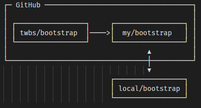

## Github 代码托管工具

Git诞生后，使用过程中，延申出来很多问题，比如可以fork别人的项目，但是没有办法帮助开发人员寻找开源项目，然后两位创始人就想着创建一个代码托管的地方，后来就诞生了Github

我们一直用GitHub作为免费的远程仓库，如果是个人的开源项目，放到GitHub上是完全没有问题的。其实GitHub还是一个开源协作社区，通过GitHub，既可以让别人参与你的开源项目，也可以参与别人的开源项目。

在GitHub出现以前，开源项目开源容易，但让广大人民群众参与进来比较困难，因为要参与，就要提交代码，而给每个想提交代码的群众都开一个账号那是不现实的，因此，群众也仅限于报个bug，即使能改掉bug，也只能把diff文件用邮件发过去，很不方便。

但是在GitHub上，利用Git极其强大的克隆和分支功能，广大人民群众真正可以第一次自由参与各种开源项目了。

如何参与一个开源项目呢？比如人气极高的`bootstrap`项目，这是一个非常强大的CSS框架，你可以访问它的项目主页`https://github.com/twbs/bootstrap`，点“Fork”就在自己的账号下克隆了一个bootstrap仓库，然后，从自己的账号下clone：

```sh
git clone git@github.com:michaelliao/bootstrap.git
```
一定要从自己的账号下clone仓库，这样你才能推送修改。如果从bootstrap的作者的仓库地址`git@github.com:twbs/bootstrap.git`克隆，因为没有权限，你将不能推送修改。

`Bootstrap`的官方仓库`twbs/bootstrap`、你在`GitHub`上克隆的仓库`my/bootstrap`，以及你自己克隆到本地电脑的仓库，他们的关系就像下图显示的那样



如果你想修复`bootstrap`的一个bug，或者新增一个功能，立刻就可以开始干活，干完后，往自己的仓库推送。

如果你希望`bootstrap`的官方库能接受你的修改，你就可以在GitHub上发起一个`pull request`。当然，对方是否接受你的`pull request`就不一定了。

`Github` 对于开发人员来讲，一般以个人账户做一些开源分享和博客, 但他的功能远不止这一点，它有全套的开发流程，可以有需求提交，看板，可以做持续集成、交付、开发（CI/CD）功能

更多介绍请百科，更多Github功能和使用各位看客请自行百科学习，这里不多赘述

## GitLab 代码托管工具

`GitLab` 是一个用于仓库管理系统的开源项目，使用`Git`作为代码管理工具，并在此基础上搭建起来的web服务。

开源免费，使用`Git`的企业，代码托管通常用`GitLab`

`Github` 能做的GitLab基本都可以做，整个全研发生命周期，它都有提供项目管理,代码创库管理,verify,监控等等

更多介绍请百科，更多Github功能和使用各位看客请自行百科学习，这里不多赘述

## Git 命令管理工具

* IDE自带git启用
* 命令行 cmd、shell、git base、Cmder（推荐，支持git-base写法、可分屏，漂亮节点）、ConsoleZ、iTerm2（仅mac系统）
* SourceTree 图形化界面管理（推荐、方便对比）

根据自己喜好选择，推荐Windows用户Cmder，Mac OS用户使用iTerm2 ，配合图形化界面SourceTree