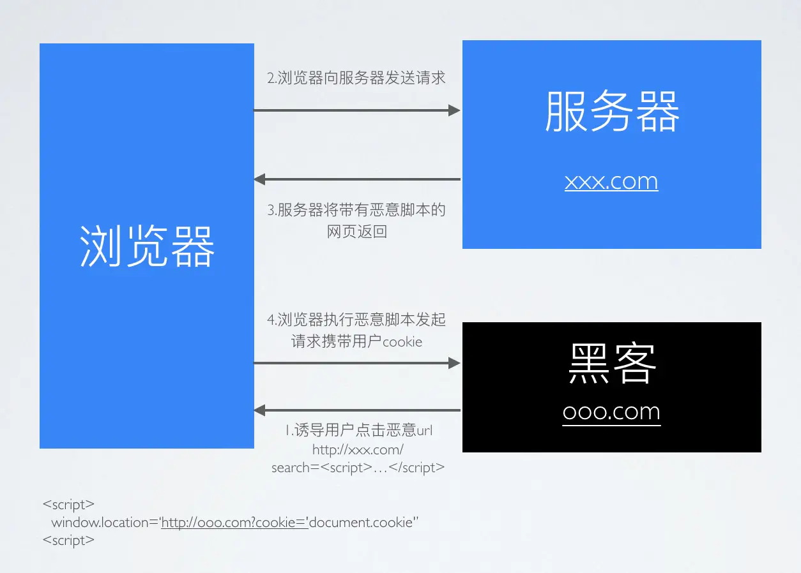
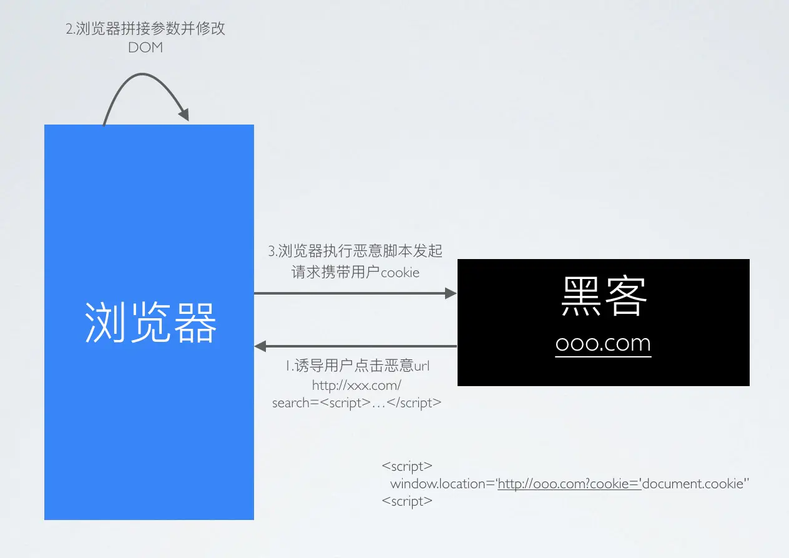
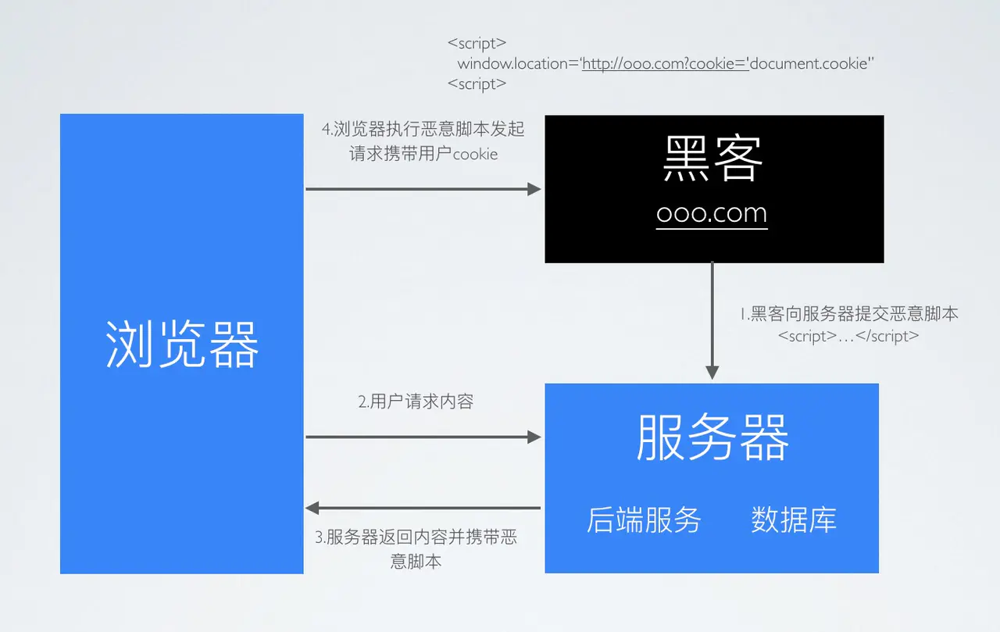

## XSS

> **跨网站指令码**（英语：Cross-site scripting，通常简称为：XSS）是一种网站应用程式的安全漏洞攻击，是[代码注入](https://www.wikiwand.com/zh-hans/%E4%BB%A3%E7%A2%BC%E6%B3%A8%E5%85%A5)的一种。它允许恶意使用者将程式码注入到网页上，其他使用者在观看网页时就会受到影响。这类攻击通常包含了 HTML 以及使用者端脚本语言。

XSS 分为三种：反射型，存储型和 DOM-based

### 如何攻击

XSS 通过修改 HTML 节点或者执行 JS 代码来攻击网站。

例如通过 URL 获取某些参数

```html
<!-- http://www.domain.com?name=<script>alert(1)</script> -->
<div>{{name}}</div>                                                  
```

上述 URL 输入可能会将 HTML 改为 `<div><script>alert(1)</script></div>` ，这样页面中就凭空多了一段可执行脚本。这种攻击类型是反射型攻击，也可以说是 DOM-based 攻击。

也有另一种场景，比如写了一篇包含攻击代码 `<script>alert(1)</script>` 的文章，那么可能浏览文章的用户都会被攻击到。这种攻击类型是存储型攻击，也可以说是 DOM-based 攻击，并且这种攻击打击面更广。

### 如何防御

最普遍的做法是转义输入输出的内容，对于引号，尖括号，斜杠进行转义

```js
function escape(str) {
	str = str.replace(/&/g, "&amp;");
	str = str.replace(/</g, "&lt;");
	str = str.replace(/>/g, "&gt;");
	str = str.replace(/"/g, "&quto;");
	str = str.replace(/'/g, "&#39;");
	str = str.replace(/`/g, "&#96;");
    str = str.replace(/\//g, "&#x2F;");
    return str
}
```

通过转义可以将攻击代码 `<script>alert(1)</script>` 变成

```js
// -> &lt;script&gt;alert(1)&lt;&#x2F;script&gt;
escape('<script>alert(1)</script>')
```

对于显示富文本来说，不能通过上面的办法来转义所有字符，因为这样会把需要的格式也过滤掉。这种情况通常采用白名单过滤的办法，当然也可以通过黑名单过滤，但是考虑到需要过滤的标签和标签属性实在太多，更加推荐使用白名单的方式。

```js
var xss = require("xss");
var html = xss('<h1 id="title">XSS Demo</h1><script>alert("xss");</script>');
// -> <h1>XSS Demo</h1>&lt;script&gt;alert("xss");&lt;/script&gt;
console.log(html);
```

以上示例使用了 `js-xss` 来实现。可以看到在输出中保留了 `h1` 标签且过滤了 `script` 标签

### CSP

> 内容安全策略   ([CSP](https://developer.mozilla.org/en-US/docs/Glossary/CSP)) 是一个额外的安全层，用于检测并削弱某些特定类型的攻击，包括跨站脚本 ([XSS](https://developer.mozilla.org/en-US/docs/Glossary/XSS)) 和数据注入攻击等。无论是数据盗取、网站内容污染还是散发恶意软件，这些攻击都是主要的手段。

我们可以通过 CSP 来尽量减少 XSS 攻击。CSP 本质上也是建立白名单，规定了浏览器只能够执行特定来源的代码。

通常可以通过 HTTP Header 中的 `Content-Security-Policy` 来开启 CSP

- 只允许加载本站资源

  ```http
  Content-Security-Policy: default-src ‘self’
  ```

- 只允许加载 HTTPS 协议图片

  ```http
  Content-Security-Policy: img-src https://*
  ```

- 允许加载任何来源框架

  ```http
  Content-Security-Policy: child-src 'none'
  ```

更多属性可以查看 [这里](https://content-security-policy.com/)

## CSRF

> **跨站请求伪造**（英语：Cross-site request forgery），也被称为 **one-click attack** 或者 **session riding**，通常缩写为 **CSRF** 或者 **XSRF**， 是一种挟制用户在当前已登录的Web应用程序上执行非本意的操作的攻击方法。[[1\]](https://www.wikiwand.com/zh/%E8%B7%A8%E7%AB%99%E8%AF%B7%E6%B1%82%E4%BC%AA%E9%80%A0#citenoteRistic1) 跟[跨網站指令碼](https://www.wikiwand.com/zh/%E8%B7%A8%E7%B6%B2%E7%AB%99%E6%8C%87%E4%BB%A4%E7%A2%BC)（XSS）相比，**XSS** 利用的是用户对指定网站的信任，CSRF 利用的是网站对用户网页浏览器的信任。

简单点说，CSRF 就是利用用户的登录态发起恶意请求。

### 如何攻击

假设网站中有一个通过 Get 请求提交用户评论的接口，那么攻击者就可以在钓鱼网站中加入一个图片，图片的地址就是评论接口

```html

```

 如果接口是 Post 提交的，就相对麻烦点，需要用表单来提交接口

```html
<form action="http://www.domain.com/xxx" id="CSRF" method="post">
    <input name="comment" value="attack" type="hidden">
</form>
```

### 如何防御

防范 CSRF 可以遵循以下几种规则：

1. Get 请求不对数据进行修改
2. 不让第三方网站访问到用户 Cookie
3. 阻止第三方网站请求接口
4. 请求时附带验证信息，比如验证码或者 token

#### SameSite

可以对 Cookie 设置 `SameSite` 属性。该属性设置 Cookie 不随着跨域请求发送，该属性可以很大程度减少 CSRF 的攻击，但是该属性目前并不是所有浏览器都兼容。

#### 验证 Referer

对于需要防范 CSRF 的请求，我们可以通过验证 Referer 来判断该请求是否为第三方网站发起的。

#### Token

服务器下发一个随机 Token（算法不能复杂），每次发起请求时将 Token 携带上，服务器验证 Token 是否有效。

## 密码安全

密码安全虽然大多是后端的事情，但是作为一名优秀的前端程序员也需要熟悉这方面的知识。

### 加盐

对于密码存储来说，必然是不能明文存储在数据库中的，否则一旦数据库泄露，会对用户造成很大的损失。并且不建议只对密码单纯通过加密算法加密，因为存在彩虹表的关系。

通常需要对密码加盐，然后进行几次不同加密算法的加密。

```js
// 加盐也就是给原密码添加字符串，增加原密码长度
sha256(sha1(md5(salt + password + salt)))
```

但是加盐并不能阻止别人盗取账号，只能确保即使数据库泄露，也不会暴露用户的真实密码。一旦攻击者得到了用户的账号，可以通过暴力破解的方式破解密码。对于这种情况，通常使用验证码增加延时或者限制尝试次数的方式。并且一旦用户输入了错误的密码，也不能直接提示用户输错密码，而应该提示账号或密码错误。


## 0.CIA三元组知道吗？

- 机密性（`Confidentiality`）
- 完整性（`Integrity`）
- 可用性（`Availability`）

(这三个东西一定要回答的干净利落，不假思索)

## 1.XSS攻击是如何产生的？

黑客在你的浏览器中插入一段恶意 `JavaScript` 脚本，窃取你的隐私信息、冒充你的身份进行操作。这就是 XSS 攻击(`Cross-Site Scripting`，跨站脚本攻击)

因为浏览器无法区分脚本是被恶意注入的还是正常的内容，它都会执行，况且 `HTML` 非常灵活，可以在任何时候对它进行修改。

## 2.知道XSS有哪几种类型吗？

（送分题）

- 反射型 XSS (也叫非持久型)
- 基于 DOM 的 XSS
- 存储型 XSS (也叫持久型 XSS)

## 3.分别说一下它们的实现原理

`反射型`：顾名思义，恶意 `JavaScript` 脚本属于用户发送给网站请求中的一部分，随后网站又将这部分返回给用户，恶意脚本在页面中被执行。一般发生在前后端一体的应用中，服务端逻辑会改变最终的网页代码。

`基于DOM型`：目前更流行前后端分离的项目，反射型 XSS 无用武之地。但这种攻击不需要经过服务器，我们知道，网页本身的 `JavaScript` 也是可以改变 `HTML` 的，黑客正是利用这一点来实现插入恶意脚本。

`存储型`：又叫持久型 XSS，顾名思义，黑客将恶意 `JavaScript` 脚本长期保存在服务端数据库中，用户一旦访问相关页面数据，恶意脚本就会被执行。常见于搜索、微博、社区贴吧评论等。

## 4.说一说它们之间的区别

`反射型的 XSS` 的恶意脚本存在 `URL` 里，`存储型 XSS` 的恶意代码存在数据库里。

而基于`DOM型的XSS` 攻击中，取出和执行恶意代码由浏览器端完成，属于前端 `JavaScript` 自身的安全漏洞，其他两种 `XSS` 都属于服务端的安全漏洞。

(面试官微微抬起头，递给我一张纸。)

## 5.再画个图解释一下把

(好的，给你降维解释一波)

### 反射型



### 基于DOM型



### 存储型



（面试官：小伙子图画的不错）

## 6.黑客可以通过XSS攻击做哪些事儿？

- 盗取用户 Cookie
- 未授权操作
- 修改 DOM
- 刷浮窗广告
- 发动 XSS 蠕虫攻击
- 劫持用户行为，进一步渗透内网

(...太多了)

## 7.XSS攻击如何进行防护？

- 一切用户输入皆不可信，`在输出时进行验证`
- 将 `HTML 元素内容、属性以及 URL 请求参数、CSS 值进行编码`
- 当编码影响业务时，使用`白名单规则进行检测和过滤`
- 使用 W3C 提出的 `CSP (Content Security Policy，内容安全策略)`，定义域名白名单
- 设置 `Cookie 的 HttpOnly` 属性

## 8.知道哪些XSS攻击案例简单说一下

(没想到你还爱听新闻)

- 2005年，年仅19岁的 Samy Kamkar 发起了对 MySpace.com 的 XSS Worm 攻击。Samy Kamkar 的蠕虫在短短几小时内就感染了100万用户——它在每个用户的自我简介后边加了一句话：“but most of all, Samy is my hero.”（Samy是我的偶像）。这是 Web 安全史上第一个重量级的 XSS Worm，具有里程碑意义。
- 2007年12月，百度空间收到蠕虫攻击，用户之间开始转发垃圾短消息。
- QQ 邮箱 m.exmail.qq.com 域名被发现反射型 XSS 漏洞
- 2011年新浪微博曾被黑客 XSS 攻击，黑客诱导用户点击一个带有诱惑性的链接，便会自动发送一条带有同样诱惑性链接微博。攻击范围层层扩大，也是一种蠕虫攻击。

## 9.什么是CSRF攻击？

CSRF 英文全称是 `Cross-site request forgery`，又称为“跨站请求伪造”。

顾名思义，`CSRF 攻击就是黑客引诱用户打开黑客的网站，利用用户的登陆状态发起跨站请求。`

降维解释：攻击者诱导受害者进入第三方网站，在第三方网站中，向被攻击网站发送跨站请求。利用受害者在被攻击网站已经获取的注册凭证，绕过后台的用户验证， 达到冒充用户对被攻击的网站执行某项操作的目的。

## 10.CSRF攻击一般怎么实现？

- 最容易实现的是 `Get` 请求，一般进入黑客网站后，可以通过设置 `img`的 `src` 属性来自动发起请求
- 在黑客的网站中，构造隐藏表单来自动发起 `Post` 请求
- 通过引诱链接诱惑用户点击触发请求，利用 `a` 标签的 `href`。

[点击下载美女视频](https://juejin.im/post/6844904100945985543)

## 11.CSRF攻击和XSS攻击有什么区别？

CSRF 攻击不需要将恶意代码注入用户的页面，仅仅是利用服务器的漏洞和用户的登录状态来实施攻击。

CSRF 攻击成本也比 XSS 低，用户每天都要访问大量网页，无法确认每一个网页的合法性，从用户角度来说，无法彻底防止 CSRF 攻击。

## 12.那应该如何防范CSRF攻击？

- 针对实际情况，设置关键 Cookie 的 `SameSite` 属性为 `Strict` 或 `Lax`
- 服务端验证请求来源站点(`Referer、Origin`)
- 使用 `CSRF Token`，服务端随机生成返回给浏览器的 Token，每一次请求都会携带不同的 CSRF Token
- 加入二次验证(独立的支付密码)

## 13.关于Web密码学你了解哪些呢？

- 对称加密算法
  - 对称加密算法就是加密和解密使用同一个密钥，简单粗暴
  - 常见的经典对称加密算法有 `DES、AES(AES-128)、IDEA、国密SM1、国密SM4`
- 非对称加密算法
  - 非对称加密就是加密和解密使用不同的密钥。发送方使用公钥对信息进行加密，接收方收到密文后，使用私钥进行解密。
  - 主要解决了密钥分发的难题
  - 我们常说的签名就是私钥加密
  - 常见的经典非对称加密算法有`RSA、ECC和国密SM2`
- 散列算法
  - 不可逆性、鲁棒性、唯一性
  - `MD5、SHA(SHA-256)、国密SM3`
  - 使用时记得加盐

`AES` 是国际上最认可的密码学算法，只要算力没有极大的突破性进展，这种算法在可预期的未来都是安全的。

`ECC` 是目前国际上加密强度最高的非对称加密算法。

`MD5` 和 `SHA` 的唯一性被*解了，但是大部分场景下，不会构成安全问题。一般使用 `SHA-256 加盐`即可满足大部分使用场景。

## 14.简单说一下HTTPS的实现原理

1. Client 发送 `random1+对称加密套件列表+非对称加密套件列表`
2. Server 收到信息， 选择 `对称加密套件+非对称加密套件 并和 random2+证书(公钥在证书中)` 一起返回
3. Client 验证证书有效性，并用 `random1+random2 生成 pre-master 通过服务器公钥加密+浏览器确认` 发送给 Server
4. Server 收到 pre-master，`根据约定的加密算法对 random1+random2+pre-master（解密）生成 master-secret，然后发送服务器确认`
5. Client 收到生成同样的 `master-secert`，对称加密秘钥传输完毕

(基操，勿6)

HTTPS 在 TCP 和 HTTP 中间加入了 SSL/TLS 安全层。

- 对发起 HTTP 请求的数据进行加密操作
- 对接收到 HTTP 的内容进行解密操作。

采用对称加密的方式加密传输数据和非对称加密的方式来传输密钥，既可以解决传输效率问题也能保证两端数据的安全传输。除此之外，为了能够证明服务器是可靠的，引入了数字证书，让浏览器验证证书的可靠性。

