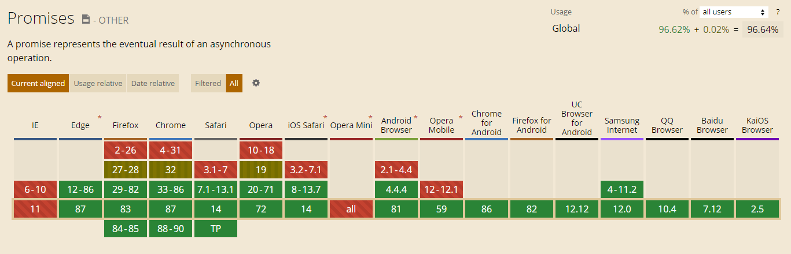
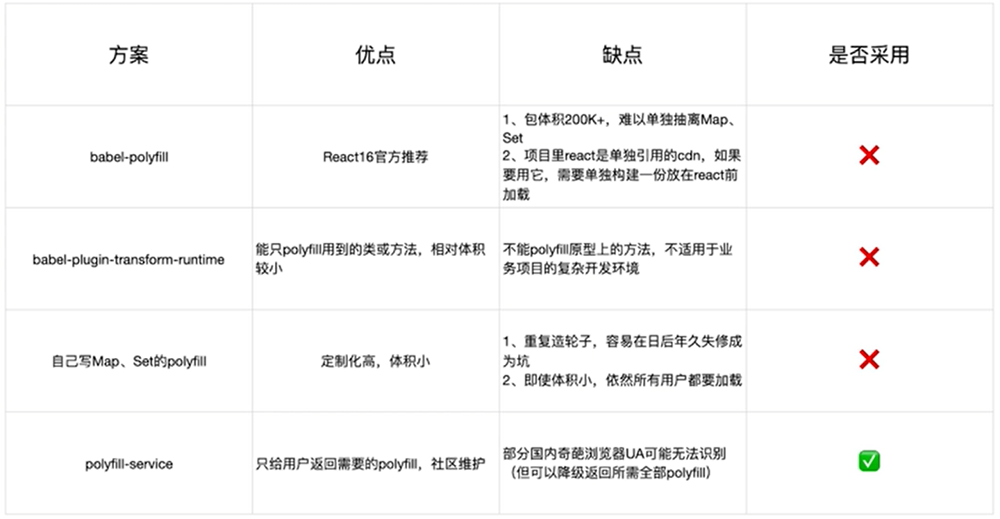

## tree shaking(摇树优化)

> 概念：1 个模块可能有多个方法，只要其中的某个方法使用到了，则整个文件都会被打到 bundle 里面去，tree shaking 就是只把用到的方法打入 bundle ，没用到的方法会在 uglify 阶段被擦除掉。  
> 使用：webpack 默认支持，在 .babelrc 里设置 modules: false 即可 production mode的情况下默认开启   
> 要求：必须是 ES6 的语法，CJS 的方式不支持

### DCE (Dead code elimination)
- 代码不会被执行，不可到达
- 代码执⾏的结果不会被用到
- 代码只会影响死变量（只写不读）

### Tree-shaking 原理

利用 ES6 模块的特点: 

- 只能作为模块顶层的语句出现 
- import 的模块名只能是字符串常量 
- import binding 是 immutable的

代码擦除： uglify 阶段删除⽆用代码

## 无用的 CSS 如何删除掉？

- PurifyCSS: 遍历代码，识别已经用到的 CSS class
- uncss: HTML 需要通过 jsdom 加载，所有的样式通过PostCSS解析，通过 document.querySelector 来识别在 html 文件里面不存在的选择器

### 在 webpack 中如何使用 PurifyCSS

使用 [purgecss-webpack-plugin](https://github.com/FullHuman/purgecss/tree/master/packages/purgecss-webpack-plugin) 和 mini-css-extract-plugin 配合使用

```js
const path = require('path')
const glob = require('glob')
const MiniCssExtractPlugin = require('mini-css-extract-plugin')
const PurgeCSSPlugin = require('purgecss-webpack-plugin')
const PATHS = {
  src: path.join(__dirname, 'src')
}
module.exports = {
  plugins: [
    new MiniCssExtractPlugin({
      filename: "[name].css",
    }),
    new PurgeCSSPlugin({
      // 支持多页面的话，需要使用glob匹配多页面
      paths: glob.sync(`${PATHS.src}/**/*`,  { nodir: true }),
    }),
  ]
}
```

## 图片压缩

基于 `Node` 库的 `imagemin` 或者 tinypng API

webpack 与之（imagemin）对应的是 `image-webpack-loader`

### Imagemin的优点分析

- 有很多定制选项
- 可以引入更多第三方优化插件，例如pngquant
- 可以处理多种图片格式

示例

```js
rules: [{
  test: /\.(gif|png|jpe?g|svg)$/i,
  use: [
    'file-loader',
    {
      loader: 'image-webpack-loader',
      options: {
        mozjpeg: {
          progressive: true,
        },
        // optipng.enabled: false will disable optipng
        optipng: {
          enabled: false,
        },
        pngquant: {
          quality: [0.65, 0.90],
          speed: 4
        },
        gifsicle: {
          interlaced: false,
        },
        // the webp option will enable WEBP
        webp: {
          quality: 75
        }
      }
    },
  ],
}]
```
> mozjpeg — Compress JPEG images
> optipng — Compress PNG images
> pngquant — Compress PNG images
> svgo — Compress SVG images
> gifsicle — Compress GIF images

### Imagemin的压缩原理

- pngquant: 是一款PNG压缩器，通过将图像转换为具有alpha通道（通常比24/32位PNG 文件小60-80％）的更高效的8位PNG格式，可显著减小文件大小。
- pngcrush:其主要目的是通过尝试不同的压缩级别和PNG过滤方法来降低PNG IDAT数据 流的大小。
- optipng:其设计灵感来自于pngcrush。optipng可将图像文件重新压缩为更小尺寸，而不 会丢失任何信息。
- tinypng:也是将24位png文件转化为更小有索引的8位图片，同时所有非必要的metadata 也会被剥离掉

## 动态 Polyfill

`babel-polyfill` 打包后体积：88.49k 

### Promise 的浏览器支持情况


支持度很高，我们不能为了小部分用户可以用，就让90+的用户去下载88.49k的`babel-polyfill`,但是也不能舍弃这小部分用户，所以我们采用动态方案

### 方案


Polyfill Service原理

> 识别 User Agent，下发不同的 Polyfill

polyfill.io 官方提供的服务

[https://polyfill.io/v3/polyfill.js](https://polyfill.io/v3/polyfill.js)
