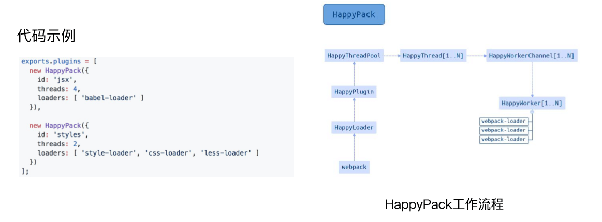

## 资源并行解析可选方案

- thread-loader 官网推出
- parallel-webpack 
- HappyPack 社区推出

### 使用 HappyPack 解析资源

原理：每次 webapck 解析一个模块，HappyPack 会将它及它的依赖分配给 worker 线程中



```js
const HappyPack = require('happypack');
module.exports = {
  mode: 'production',
  module: {
      rules: [
        {
            test: /.js$/,
            use: [
              'happypack/loader'
            ]
        },
        ...
      ]
  },
  plugins:[
    new HappyPack({
      loaders: [ 'babel-loader' ]
    }),
  ]
}
```
[官网说明](https://www.npmjs.com/package/happypack)

> Maintenance mode notice
>
> My interest in the project is fading away mainly because I'm not using JavaScript as much as I was in the past. Additionally, Webpack's native performance is improving and (I hope) it will soon make this plugin unnecessary.
> 
> See the FAQ entry about Webpack 4 and thread-loader.
> 
> Contributions are always welcome. Changes I make from this point will be restricted to bug-fixing. If someone wants to take over, feel free to  get in touch.
> 
> Thanks to everyone who used the library, contributed to it and helped in refining it!!!

说的明白的了，推荐大家用官方推荐的`thread-loader`

### 使用 thread-loader 解析资源

原理：每次 webpack 解析一个模块，threadloader 会将它及它的依赖分配给 worker 线程中

[官网说明](https://www.npmjs.com/package/thread-loader)

```js
module.exports = {
  module: {
    rules: [
      {
        test: /\.js$/,
        include: path.resolve('src'),
        use: [
          {
            loader: 'thread-loader',
            options: {
              // the number of spawned workers, defaults to (number of cpus - 1) or
              // fallback to 1 when require('os').cpus() is undefined
              workers: 3, //开启3个workder进程
            }
          },
          // your expensive loader (e.g babel-loader)
        ]
      },
      ...
    ]
  },
};

```

### 并行压缩

- 使用 parallel-uglify-plugin 插件
- uglifyjs-webpack-plugin 开启 parallel 参数 （已不维护，推荐固官网的terser-webpack-plugin）
- terser-webpack-plugin 开启 parallel 参数 （官网推荐）


```js
const TerserPlugin = require('terser-webpack-plugin');

module.exports = {
  optimization: {
    minimize: true,
    minimizer: [
      new TerserPlugin({
        parallel: 4, // true
      }),
    ],
  },
};
```