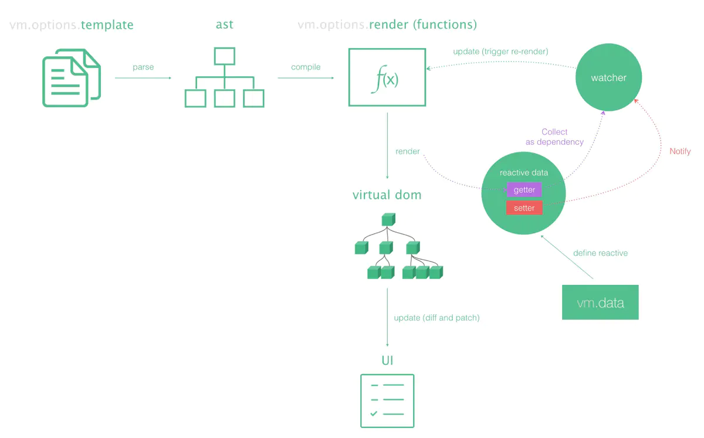

<!-- more -->
# Vue2.0 和Vue3.0响应式原理分析-简版

## Vue2.0响应式原理核心步骤

### Vue2.0响应式架构图



###observe(数据观察方法)

```javascript
function observer(target){
  
  // 非对象 返回原理数据
  if(typeof target !== 'object' || target == null) return target
  
 	//...

  // 循环所有key去走数据劫持
  for(let key in target){
    defineReactive(target,key,target[key])
  }
}
```

如上图所示，observe函数所做的工作就是遍历data的每一个属性，对这些属性依次做响应式处理

###defineProperty(劫持监听的数据)

```javascript
function defineReactive(target,key,value){
  // 递归，数据嵌套需要劫持深层次key
  observer(value)
  // 数据劫持
  // 使用Object.defineProperty 就可以重写定义属性 添加描述符 getter和setter
  Object.defineProperty(target,key,{
    get(){
      // get中略----- Dep.target 即将当前的Watcher对象存入dep的subs中--也就是依赖收集
      return value
    },
    set(newValue){
      if(newValue !== value){
        // 如果赋新值为Object类型，同样需要递归，做新的数据劫持，否则数据无法更新到视图
        observer(newValue)
        // 更新视图
        updatedView()
        value = newValue

        // set里略------ dep.notify() 在set的时候出发dep的notify来通知所有的watcher对象更新视图
      }
    }
  })
}
```

而所谓的响应式处理，则是拦截属性的get、set方法做订阅-发布处理。订阅-发布处理，就是在属性被调用的使用，触发get代理函数，订阅调用该属性的组件(将组件存放到一个订阅者数组中进行保存，这里的Dep.target暂时可以理解为一个全局变量，代表着的是当前正在渲染的Vue组件)。 而在属性被修改时，触发set代理函数，在set代理函数里，通知订阅者数组里面的每一个订阅者（组件）进行视图更新。

####Dep

上文中提到的Dep，是一个依赖类，将它理解成一个订阅者。当对一个属性进行响应式处理的时候，就会实例化一个Dep实例，并将用到这个属性的组件全部存放在subs数组里。当属性被修改时，则通知subs数组里的所有组件进行更新。

```javascript
class Dep{
  constructor(){
    // 用来存放Watcher对象数组
    this.subs = []
  }
 // 在subs中添加一个Watcher对象
  addSub(sub){
    this.subs.push(sub)
  }
  // 通知所有Watcher更新视图
  notfiy(){
    this.subs.forEach(sub=>{
      // 通知数据更新
      sub.update()
    })
  }
}
```

### Watcher

上面我们说到，dep.subs里面存的是用到该属性的组件，这个说法实际上不完全对。准确来说，dep.subs里面存的是用到该属性的组件所对应的一个Watcher实例。什么是Watcher？每一个组件在渲染之前，会对其自身的template模版进行解析编译，生成一个render函数（用于创建虚拟dom）。然后，会实例化一个Watcher对象，在实例化的过程中，会将之前生成的render函数作为参数传入进去执行。而在执行render的过程中，势必会触发相应属性的get函数，将这个watcher实例添加到相应属性的订阅者数组subs当中。等这些属性进行被修改时，就会通知这个watcher，再次调用这个watcher里面的render函数，进行虚拟dom的diff和更新。

###Compile

```
 * 1、取真实dom节点
 * 2、我们fragment 创建文档碎片，将真是dmo，移动指缓存
 * 3、编译虚拟dom，解析模版语法
 * 4、回填至真是dom，实现模版语法解析，更新试图
```


## Vue3.0响应式原理核心步骤

###写在前面

Vue3.0 Beta 刚刚发布，早在去年的时候alpha版本的时候核心代码就已经公开了，很多大佬就在学习和分享，我们也是时候问一问香不香了

[尤雨溪在Vue3.0 Beta直播20200421笔记](https://juejin.im/post/5e9f6b3251882573a855cd52#heading-0)

[Vue 3.0 这个迷人的小妖精，到底好在哪里？](https://juejin.im/post/5e9ce011f265da47b8450c11#heading-0)

###预备知识
Proxy：es6 中新的代理内建工具类

Reflect：es6 中新的反射工具类

WeakMap：es6 中新的弱引用映射

### Vue2.0响应式原理的不足

1.动态添加响应式属性必须用Vue.set

2.直接操作数组索引无法触发视图更新

3.数据的响应式处理和视图未完全解耦

### Vue3.0响应式原理框架图

 

由图中我们看出，Vue3.0响应式框架在设计上，将视图渲染和数据响应式完全分离开来。将响应式核心方法effect从原有的Watcher中抽离。这样，当我们只需要监听数据响应某种逻辑回调(例如监听某个text属性的变化，对他进行正则校验等。)，而不需要更新视图的时候，完全可以只从effect触发，屏蔽左边的视图渲染。

### Prxoy(实现数据劫持)

在之前的版本中，`vue` 利用 `Object.defineProperty` 中的 `setter` 和 `getter` 来对数据对象进行劫持，`vue-next` 则通过 `Proxy`。众所周知，`Object.defineProperty` 所实现的数据劫持是有一定限制的，而 `Proxy` 就会强大很多。

首先，我们在脑后中，设想一下如何使用 `Proxy` 来实现数据劫持呢？很简单，大体结构如下所示：

```javascript
export function reactive(obj) {
  const proxied = new Proxy(obj, handlers);

  return proxied;
}
```
这里的 handlers 是声明如何处理各个 trap 的逻辑，比如：
```javascript
const handlers = {
    get: function(target, key, receiver) {
        ...
    },
    set: function(target, key, value, receiver) {
        ...
    },
    deleteProperty(target, key) {
        ...
    }
    // ...以及其他 trap
  }
```
由于这里是极简版本的实现，那么我们就仅仅实现 get 和 set 两个 trap 就可以了，分别对应依赖收集和触发响应的逻辑。

### 1、reactive(初始化代理对象) 

实现了数据劫持的代理逻辑之后，我们只需要在 `reactive` 这个方法中，返回一个代理对象的实例即可

```javascript
let toProxy = new WeakMap() // es6 弱引用映射表； 放置 源对象：代理过的对象
let toRaw = new WeakMap() // 被代理过的对象：源对象

// 判断是不是对象
function isObject(val) {
  return typeof val === "object" && val !== null
}

// 对象是否包含该属性
function hasOwn(target,key){
  return target.hasOwnProperty(key)
}

// ------------------------------- 响应式的核心 -------------------------------

// 响应式的核心方法
function reactive(target) {
  // ...
  // 创建响应式对象
  return createReactiveObject(target)
}


// 创建响应式对象
function createReactiveObject(target) {
  
  // 是否是对象，不是对象返回即可
  if (!isObject(target)) return target

  
  // 如果已经代理过，直接返回代理结果即可
  let proxy = toProxy.get(target)
  if (toProxy.get(target)) {
    return proxy
  }

  // 防止代理对象再次被代理
  if (toRaw.has(target)) { 
    return target
  }
  
  
  let baseHandler = {
    // reflect 优点 不会报错，而且有返回值 会替代Oject上的方法

    get(target, key, receiver) {
      console.log("get")
      // proxy + Reflect 反射
      let result = Reflect.get(target, key, receiver)

      // 收集依赖 订阅 =》把当前的key和effect 建立关联
      
      track(target,key) // 如果目标上key变化了，重新让数组中的effect执行

      return isObject(result) ? reactive(result) : result
    },
    set(target, key, value, receiver) {
      console.log('set')
      
      let hadKey = hasOwn(target,key) // 判断以前有没有这个属性
      let oldValue = target[key]
      let res = Reflect.set(target, key, value, receiver)
      if(!hadKey){
        trigger(target,'add',key)
        console.log("新增属性")
      }else if (oldValue !== value){
        // 表示这个属性改过了
        trigger(target,'set',key)
        console.log("修改属性")
      }

      return res
    }
  }
  let observed = new Proxy(target, baseHandler) //es6

  toProxy.set(target, observed)
  toRaw.set(observed, target)

  return observed
}

// let proxy = reactive({name:1})
// proxy.name = 2
// console.log(proxy.name)
```

从代码可以看出，Vue3.0响应式相对于Vue2.0的最大区别在于用到了es6中的方法Proxy。这个方法不需要循环遍历data的每个属性，对每个属性都做一遍响应式处理。而是直接代理了整个data对象，拦截这个对象所包含的所有属性的get、set方法。这么做的好处:

1.就是在我们动态为data添加一个属性时，不用做任何处理，这个属性就已经是响应式的了。

2.数组的任何操作也都可以触发响应。


### 2、effect(依赖收集)

上面的设计，其实已经解决了Vue2.0的前两个不足。而为了解决数据的响应式处理和视图未完全解耦， Vue3.0提出了effect函数，其用法如下：


对于依赖收集的工作，我们是有条件地进行的，即在一个 `effect` 中，我们才会进行收集，其他情况下的取值逻辑，我们则不会进行依赖收集，因此，`effect` 方法正式为了实现这点而存在的，如下：


```javascript
// ------------------------------- effect 依赖收集 -------------------------------

function effect (fn){
  // ...
  // 需要把fn这个函数变成响应式函数
  let effect = createReactiveEffect(fn)
  // 默认应该先执行一次
  effect() 
}


function createReactiveEffect(fn){
  let effect = function(){
    // 创建响应式的effect

    return run(effect,fn) // 1、让fn允许，2、把effect存到栈中
  }
  return effect
}

// 允许fn 并且将effect 存起来
function run(effect,fn){
  try{
    activeEffectStacks.push(effect)
    fn() // v2利用了js单线程
  }finally{
    activeEffectStacks.pop()
  }
}


// 依赖收集 发布订阅
let obj = reactive({name:{a:1}})
effect(()=>{
  // effect 默认执行一次；之后依赖数据变化了会再次执行
  console.log(obj.name) 
})

obj.name = 2
```

我们来看这个effect函数做了什么？简单来说，effect会先将传入的回调函数保存起来，然后第一次执行cb(),在执行的过程中，触发了obj.name属性的get代理函数，在代理函数里面做订阅track(target), 而track函数则会将存在全局数组中的cb函数取出来，保存在map中,类似于map.set('name',cb)。之后，在name属性被修改的时候，会触发name属性的set代理函数，在代理函数里面执行trigger。最后，trigger会将之前存在map里的订阅着取出来执行，map.get('name')()

###  3、track(动态创建依赖关系)

```javascript
// 数据结构
// {
//   target:{
//     key:[fn,fn]
//   }
// }

// 栈 先进后出  [{name:[effect]}]
let activeEffectStacks = [] //栈型结构

let targetMap= new WeakMap()

// 跟踪变化，如果target中的key变化了，就执行数组里的方法 
function track(target,key){
  let effect = activeEffectStacks[activeEffectStacks.length-1]
  // 有对应关系才创建关联
  if(effect){
    // 建立第一步映射表
    let depsMap = targetMap.get(target)
    console.log(depsMap)
    if(!depsMap){
      // {target:{}}
      targetMap.set(target,depsMap = new Map)
    }
    // 建立第二步映射表的value的键值
    let deps = depsMap.get(key)
    if(!deps){
      // {target:{key:[]}}
      depsMap.set(key,deps = new Set())
    }
    console.log(deps.has(effect))
    // 不包含的添加到Set中
    if(!deps.has(effect)){
      deps.add(effect) 
    }
  }
}
```

### 4、trigger(执行effect)

```javascript
function trigger(target,type,key){
  let desMap = targetMap.get(target)
  if(desMap){
    let deps = desMap.get(key)
    if(deps){ // 将当前key 对应的effect依次执行
      deps.forEach(effect => {
        effect() 
      });
    }
  }
}
```

## 全部可运行代码

### v2

```javascript
// vue2.0 vue 实现响应式原理


let oldArrayPrototype = Array.prototype
// 继承
let proto = Object.create(oldArrayPrototype)
let methods = ['push','shift','unshift']
methods.forEach(method=>{
  // 做函数劫持，函数重写不影响old方法，内部继续调用老的方法
  proto[method] = function(){
    updatedView()
    oldArrayPrototype[method].call(this,...arguments)
  }
})


// --------------------main--------------------

function observer(target){
  
  // 非对象 返回原理数据
  if(typeof target !== 'object' || target == null) return target
  
  // 数组类型 修改其原型链，为劫持其原型链方法而用
  if(Array.isArray(target)){

    Object.setPrototypeOf(target,proto)
    // target.__proto__ = proto
  }

  // 循环所有key去走数据劫持
  for(let key in target){
    defineReactive(target,key,target[key])
  }
}
function defineReactive(target,key,value){
  // 递归，数据嵌套需要劫持深层次key
  observer(value)
  // 数据劫持
  // 使用Object.defineProperty 就可以重写定义属性 添加描述符 getter和setter
  Object.defineProperty(target,key,{
    get(){
      // get中略----- Dep.target 即将当前的Watcher对象存入dep的subs中--也就是依赖收集
      return value
    },
    set(newValue){
      if(newValue !== value){
        // 如果赋新值为Object类型，同样需要递归，做新的数据劫持，否则数据无法更新到视图
        observer(newValue)
        // 更新视图
        updatedView()
        value = newValue

        // set里略------ dep.notify() 在set的时候出发dep的notify来通知所有的watcher对象更新视图
      }
    }
  })
}

function updatedView() {
  console.log("updateView") 
}


// ---------------------调用------------------------
let data = {name:1,age:{n:10},ids:[1,2,3]}
observer(data);
// 测试赋值一层
data.name = 2
// 测试赋值新对象
data.age = {n:20} 
// 测试赋值新对象后数据是否被get和set
data.age.n = 30
// 测试数组  需要对数组的方法重写
data.ids.push(4) 

// 问题1:如果属性不存在 新增的属性 会是响应式吗？ 不会

```

### v3

```javascript


// vue3.0 响应式原理

/**
 * vue2.0缺点
 * 
 * 1、默认会递归
 * 2、数组改变length是无效的
 * 3、对象不存在的属性不能够被拦截
 */

//  es6知识点：Proxy Reflect WeakMap

let toProxy = new WeakMap() // es6 弱引用映射表； 放置 源对象：代理过的对象
let toRaw = new WeakMap() // 被代理过的对象：源对象

// 判断是不是对象
function isObject(val) {
  return typeof val === "object" && val !== null
}

// 对象是否包含该属性
function hasOwn(target,key){
  return target.hasOwnProperty(key)
}

// ------------------------------- 响应式的核心 -------------------------------

// 响应式的核心方法
function reactive(target) {
  // ...
  // 创建响应式对象
  return createReactiveObject(target)
}


// 创建响应式对象
function createReactiveObject(target) {
  
  // 是否是对象，不是对象返回即可
  if (!isObject(target)) return target

  
  // 如果已经代理过，直接返回代理结果即可
  let proxy = toProxy.get(target)
  if (toProxy.get(target)) {
    return proxy
  }

  // 防止代理对象再次被代理
  if (toRaw.has(target)) { 
    return target
  }
  
  
  let baseHandler = {
    // reflect 优点 不会报错，而且有返回值 会替代Oject上的方法

    get(target, key, receiver) {
      console.log("get")
      // proxy + Reflect 反射
      let result = Reflect.get(target, key, receiver)

      // 收集依赖 订阅 =》把当前的key和effect 建立关联
      
      track(target,key) // 如果目标上key变化了，重新让数组中的effect执行

      return isObject(result) ? reactive(result) : result
    },
    set(target, key, value, receiver) {
      console.log('set')
      
      let hadKey = hasOwn(target,key) // 判断以前有没有这个属性
      let oldValue = target[key]
      let res = Reflect.set(target, key, value, receiver)
      if(!hadKey){
        trigger(target,'add',key)
        console.log("新增属性")
      }else if (oldValue !== value){
        // 表示这个属性改过了
        trigger(target,'set',key)
        console.log("修改属性")
      }

      return res
    }
  }
  let observed = new Proxy(target, baseHandler) //es6

  toProxy.set(target, observed)
  toRaw.set(observed, target)

  return observed
}

// ------------------------------- track 动态创建依赖关系 -------------------------------

// 数据结构
// {
//   target:{
//     key:[fn,fn]
//   }
// }

// 栈 先进后出  [{name:[effect]}]
let activeEffectStacks = [] //栈型结构

let targetMap= new WeakMap()

// 跟踪变化，如果target中的key变化了，就执行数组里的方法 
function track(target,key){
  let effect = activeEffectStacks[activeEffectStacks.length-1]
  // 有对应关系才创建关联
  if(effect){
    // 建立第一步映射表
    let depsMap = targetMap.get(target)
    console.log(depsMap)
    if(!depsMap){
      // {target:{}}
      targetMap.set(target,depsMap = new Map)
    }
    // 建立第二步映射表的value的键值
    let deps = depsMap.get(key)
    if(!deps){
      // {target:{key:[]}}
      depsMap.set(key,deps = new Set())
    }
    console.log(deps.has(effect))
    // 不包含的添加到Set中
    if(!deps.has(effect)){
      deps.add(effect) 
    }
  }
}

// ------------------------------- trigger 数据更新 -------------------------------

function trigger(target,type,key){
  let desMap = targetMap.get(target)
  if(desMap){
    let deps = desMap.get(key)
    if(deps){ // 将当前key 对应的effect依次执行
      deps.forEach(effect => {
        effect() 
      });
    }
  }
}

// ------------------------------- effect 保存函数到数据映射表中 -------------------------------

function effect (fn){
  // ...
  // 需要把fn这个函数变成响应式函数
  let effect = createReactiveEffect(fn)
  // 默认应该先执行一次
  effect() 
}


function createReactiveEffect(fn){
  let effect = function(){
    // 创建响应式的effect

    return run(effect,fn)
  }
  return effect
}

// 允许fn 并且将effect 存起来
function run(effect,fn){
  try{
    activeEffectStacks.push(effect)
    fn() // v2利用了js单线程
  }finally{
    activeEffectStacks.pop()
  }
}


// 依赖收集 发布订阅
let obj = reactive({name:{a:1}})
effect(()=>{
  // effect 默认执行一次；之后依赖数据变化了会再次执行
  console.log(obj.name) 
})

// obj.name = 2
obj.name = 2


// 代理对象
// let proxy = reactive({name:1})
// proxy.name = '2'
// console.log(proxy.name)


// let arr = [1, 2, 3]
// let proxy = reactive(arr)
// proxy.push(4)
```