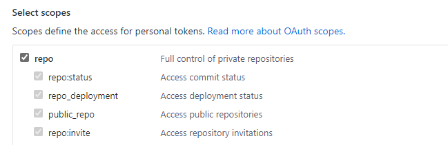
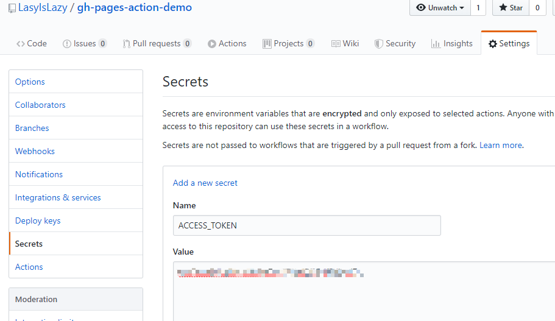
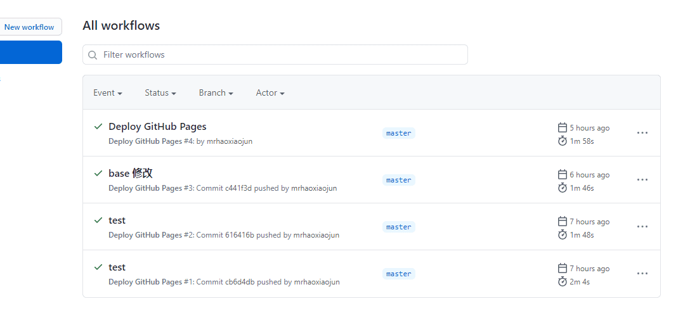

# GitHub Actions 自动部署博客

本文参考[vuepress-theme-reco](https://vuepress-theme-reco.recoluan.com/views/other/github-actions.html)但部分实践与作者不同，所有整合如下

以 Github Pages 为例，并且假设你已经掌握了 GitHub Pages 的使用。

假设你的文章和静态文件在同一个仓库，使用 `master` 分支管理文章和代码，使用 `gh-pages` 分支存放生成的静态文件

一般部署博客的流程是：

1. 写一篇文章
2. 生成静态文件：`npm run build`
3. 切换 `gh-pages` 分支
4. 复制静态文件到 `gh-pages` 分支
5. 访问网址验证是否成功

博客就是用来写文章的，每次写篇文章还要搞那么多操作。

当你使用了 GitHub Actions 之后，流程可以简化为：

1. 写一篇文章
2. 提交到 GitHub

结束了，是不是很方便？说到这里确实很开心

---

## 第一步创建项目

创建了一个[例如本站点](https://github.com/mrhaoxiaojun/ibooks)在我的 GitHub 仓库，用的是 VuePress

## 设置 Secrets

后面部署的 Action 需要有操作你的仓库的权限，因此提前设置好 GitHub personal access（个人访问令牌）。

生成教程可以看 GitHub 官方的帮助文档（相当详细，分分钟搞定）：[创建用于命令行的个人访问令牌](https://help.github.com/cn/github/authenticating-to-github/creating-a-personal-access-token-for-the-command-line)。

授予权限的时候只给 `repo` 权限即可。



令牌名字一定要叫：`ACCESS_TOKEN`，这是后面的 Action 需要用的。



## 编写 workflow 文件

> 持续集成一次运行的过程，就是一个 workflow（工作流程）。


创建`.github/workflows/main.yml`文件

```sh
name: Deploy GitHub Pages

# 触发条件：在 push 到 master 分支后
on:
  push:
    branches:
      - master

# 任务
jobs:
  build-and-deploy:
    # 服务器环境：最新版 Ubuntu
    runs-on: ubuntu-latest
    steps:
      # 拉取代码
      - name: Checkout
        uses: actions/checkout@v2
        with:
          persist-credentials: false

      # 生成静态文件
      - name: Build
        run: npm install && npm run build

      # 部署到 GitHub Pages
      - name: Deploy
        uses: JamesIves/github-pages-deploy-action@releases/v3
        with:
          ACCESS_TOKEN: ${{ secrets.ACCESS_TOKEN }}
          BRANCH: gh-pages
          FOLDER: public
```

这里我就不对语法作讲解了，需要了解 workflow 的基本语法可以查看[官方帮助](https://help.github.com/cn/actions/automating-your-workflow-with-github-actions/workflow-syntax-for-github-actions)，也可以参考[阮一峰老师的 GitHub Actions 入门教程](http://www.ruanyifeng.com/blog/2019/09/getting-started-with-github-actions.html)。

这里我写了三步：

1. 拉取代码。用到了一个 GitHub 官方 action：`actions/checkout` 。
2. 生成静态文件。直接运行脚本，如果你不是用的 VuePress 或者脚本不一样，要修改成你自己的。
3. 部署到 GitHub Pages。使用了第三方作者的 action：`JamesIves/github-pages-deploy-action@releases/v3`。我详细介绍下这个 action：

使用 `with` 参数向环境中传入了三个环境变量：

1. `ACCESS_TOKEN`：读取 GitHub 仓库 secrets 的 `ACCESS_TOKEN` 变量，也就是我们前面设置的
2. `BRANCH`：部署分支 `gh-pages`（GitHub Pages 读取的分支）
3. `FOLDER`：需要部署的文件在 `docs/.vuepress/dist` 路径，也就是我们使用 `npm run docs:build` 生成的静态文件的位置


至此，配置工作均已完成。提交你的代码，就会开启自动构建。

以后，你每次有代码 push 到 `master` 分支时，GitHub 都会开始自动构建。

## 验证

快乐的与参考文章（vuepress-theme-reco）中作者所说的错误情况擦肩而过，可能是版本的原因吧




鉴于还是有很多人不是用的 GitHub Pages，我这里再提供一下其他方式的思路，其实都是一样的，大概分成三步：

1. 拉取代码
2. 生成静态文件
3. 部署到服务器

前两步都是一样的，不同的方式区别也就在于第三步。

使用 GitHub Pages 的话可以使用 `JamesIves/github-pages-deploy-action` 这个 action，使用其他的方式其实也可以找到对应的 action。


怎么找 action，以下是几个常用的网址：

- [https://github.com/actions](https://github.com/actions)：GitHub 官方的 action
- [https://github.com/marketplace?type=actions](https://github.com/marketplace?type=actions)：GitHub 官方市场中的 action
- [https://github.com/sdras/awesome-actions](https://github.com/sdras/awesome-actions)：第三方收集的有用的 action
