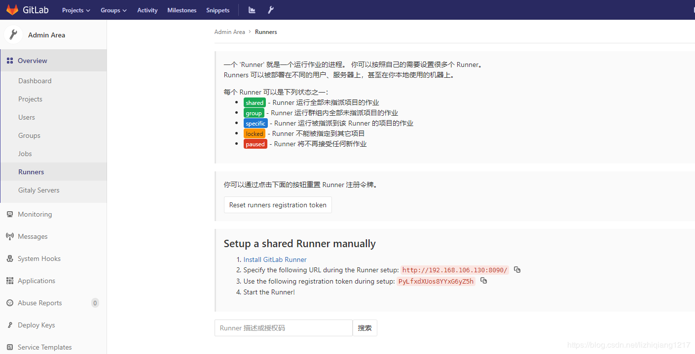

:::tip
在我们完成项目开发后，提交到git，当监听提交后，自动进行编译，并进行项目的部署，是不是一想就很爽，所以下面引入我们的主角 —— gitlab-CI，[中文文档](https://fennay.github.io/gitlab-ci-cn/)。
:::

<!-- more -->
## 基本概念

### Gitlab-CI

Gitlab-CI 是 GitLab Continuous Integration（Gitlab持续集成）的简称。
从Gitlab的8.0版本开始，gitlab就全面集成了Gitlab-CI,并且对所有项目默认开启。
只要在项目仓库的根目录添加.gitlab-ci.yml文件，并且配置了Runner（运行器），那么每一次合并请求（MR）或者push都会触发CI pipeline。

### Gitlab-Runner
GitLab-Runner是配合GitLab-CI进行使用的。一般地，GitLab里面的每一个工程都会定义一个属于这个工程的软件集成脚本，用来自动化地完成一些软件集成工作。当这个工程的仓库代码发生变动时，比如有人push了代码，GitLab就会将这个变动通知GitLab-CI。这时GitLab-CI会找出与这个工程相关联的Runner，并通知这些Runner把代码更新到本地并执行预定义好的执行脚本。

所以，GitLab-Runner就是一个用来执行软件集成脚本的东西。你可以想象一下：Runner就像一个个的工人，而GitLab-CI就是这些工人的一个管理中心，所有工人都要在GitLab-CI里面登记注册，并且表明自己是为哪个工程服务的。当相应的工程发生变化时，GitLab-CI就会通知相应的工人执行软件集成脚本。如下图所示：


### Runner类型

GitLab-Runner可以分类两种类型：Shared Runner（共享型）和Specific Runner（指定型）。

* Shared Runner：这种Runner是所有工程都能够用的。只有系统管理员能够创建Shared Runner。
* Specific Runner：这种Runner只能为指定的工程服务。拥有该工程访问权限的人都能够为该工程创建Shared Runner。

## 环境配置
###  linux 安装配置

我是将linux安装到了虚拟机（VMware Workstation Pro）上了，使用CentOS 7作为安装版本；[虚拟机安装步骤-可参考运维派](http://www.yunweipai.com/linux)

:::tip
1、作为运维小白记得，别选择最小配置，选GUI界面，慢慢熟悉了命令和网络等等再高逼格,在界面中选择网络为有线连接

2、网络坑啊，默认走的是NAT联网模式（用于共享主机ip）换句话说就是虚拟机的ip和主机ip使用同一个即主机ip，由于我没有多余的物理机ip所有没有选择桥接模式；问题来了，各种ping不通
:::

然后一顿操作，因为公司有代理，所有添加了一次性的命令代理

```sh
export http_proxy="http://xxx.xx.xx:8080"
export https_proxy="http://xxx.xx.xx:8080"
export ftp_proxy="http://xxx.xx.xx:8080"
```

1、重启网络

`service network restart`

2、通过命令查看防火墙策略

`sudo iptables -L | more`

3、如果输出内容为`Chain INPUT (policy DROP)`，再执行修改策略

`sudo iptables -P INPUT ACCEPT`

4、直到确认输出为`Chain INPUT (policy ACCEPT)`，才可清除所有规则停止防火墙

`sudo iptables -F` 

5、关闭防火墙

`systemctl stop firewalld.service`

各种坑，有时候还时有时无的网络，终于ping通了


### GitLab 安装配置

#### GitLab简介：

GitLab是一个用于仓库管理系统的开源项目。使用Git作为代码管理工具，并在此基础上搭建起来的Web服务。可通过Web界面进行访问公开的或者私人项目。它拥有GitHub类似的功能，能够浏览源代码，管理缺陷和注释。可以管理团队对仓库的访问，它非常易于浏览提交过的版本并提供一个文件历史库。团队成员可以利用内置的简单聊天程序（Wall）进行交流。它还提供了一个代码片段收集功能可以轻松实现代码复用。

#### 常用的网站：

官网：https://about.gitlab.com/

国内镜像：https://mirrors.tuna.tsinghua.edu.cn/gitlab-ce/yum/


#### 安装环境：

（1）CentOS 6或者7    （此处使用7）  
（2）2G内存（实验）生产（至少4G），不然会很卡  
（3）安装包：gitlab-ce-10.2.2-ce  
（4）禁用防火墙，关闭selinux  

#### 安装步骤：

:::tip
查看ip命令 `ifconfig` 或者 `ip addr` 命令查看
:::

（1）安装软件

```sh
[root@gitlab ~] yum install -y curl policycoreutils-python openssh-server        #安装依赖
[root@gitlab ~] wget https://mirrors.tuna.tsinghua.edu.cn/gitlab-ce/yum/el7/gitlab-ce-10.2.2-ce.0.el7.x86_64.rpm        #下载软件包
[root@gitlab ~] rpm -ivh gitlab-ce-10.2.2-ce.0.el7.x86_64.rpm    #安装gitlab
```


（2）根据安装完成提示界面进行访问URL更改及重新加载配置文件 更改次选项为自己的域名或者IP     external_url 'http://gitlab.example.com'

```sh
[root@gitlab ~] vim /etc/gitlab/gitlab.rb      #编辑配置文件  
external_url 'http://192.168.1.21'        #改为自己的IP地址
[root@gitlab ~] gitlab-ctl reconfigure    #重新加载配置文件
```

（3）重装完成访问http://192.168.1.21，会首先叫更改密码（root用户），改完后登录即可


#### Gitlab相关操作及说明：
```sh
/etc/gitlab/gitlab.rb          #gitlab配置文件
/opt/gitlab                    #gitlab的程序安装目录
/var/opt/gitlab                #gitlab目录数据目录
/var/opt/gitlab/git-data       #存放仓库数据
gitlab-ctl reconfigure         #重新加载配置
gitlab-ctl status              #查看当前gitlab所有服务运行状态
gitlab-ctl stop                #停止gitlab服务
gitlab-ctl stop nginx          #单独停止某个服务
gitlab-ctl tail                #查看所有服务的日志
```
#### Gitlab的服务构成：
```sh
nginx：                 #静态web服务器
gitlab-workhorse        #轻量级反向代理服务器
logrotate              #日志文件管理工具
postgresql             #数据库
redis                  #缓存数据库
sidekiq                #用于在后台执行队列任务（异步执行）
```

### Node 安装配置

[官网安装地址](https://nodejs.org/en/download/)

1. 例如下载node-v9.11.1-linux-x64.tar.xz文件
2. 例如放在 `/home` 文件夹
```bash
# 进入所在目录，解压
tar -xvf node-v9.11.1-linux-x64.tar.xz

# 重命名文件夹
mv node-v9.11.1-linux-x64 nodejs

# 建立软链接，配置全局环境变量（源路径和目标路径为相对路径）
ln -s /home/nodejs/bin/npm /usr/local/bin/
ln -s /home/nodejs/bin/node /usr/local/bin/

# 检查是否配置成功
node -v
npm -v
```

### 其他安装
你可能还需要安装git等想软件，本教程笔记内不需要安装

## CentOs中GitLab-Runner的安装与使用

### 安装gitlab-ci-multi-runner（linux）

:::tip
如果像我一样添加yum源，各种网络不可达，请参考我的[csdn解答](https://blog.csdn.net/mrhaoxiaojun/article/details/107464221)
:::

```bash 
# 添加yum源
curl -L https://packages.gitlab.com/install/repositories/runner/gitlab-ci-multi-runner/script.rpm.sh | sudo bash

# 安装
yum install gitlab-ci-multi-runner
```
费了老鼻子劲了，终于走了正常安装流程


### 使用 gitlab-ci-multi-runner 注册 shared Runners

#### 获取配置信息

首先去gitlab查看你的url和token这里是页面设置里的shared Runners（如果是specific Runners 请到具体工程——> settings —— > CI/CD ——> Runners）



#### 注册

:::tip
小编注册的时候报错 `ERROR: Registering runner... failed                 runner=7tDRCLBd status=couldn't execute POST against http://192.168.175.129/api/v4/runners: Post http://192.168.175.129/api/v4/runners: proxyconnect tcp: dial tcp: lookup http on 192.168.175.2:53: no such host
PANIC: Failed to register this runner. Perhaps you are having network problems `

请参考我的[csdn解答](https://blog.csdn.net/mrhaoxiaojun/article/details/107467303)
:::

接下来开始她的表演

```bash
[root@localhost ~]# git config --global http."sslVerify" false
[root@localhost ~]# gitlab-ci-multi-runner status
gitlab-runner: Service is running!
[root@localhost ~]#  gitlab-runner register
Running in system-mode.                            
#输入您的GitLab实例URL：                                                   
Please enter the gitlab-ci coordinator URL (e.g. https://gitlab.com/):
http://192.168.175.xxx/
#输入您获得的令牌以注册Runner：
Please enter the gitlab-ci token for this runner:
Gvcpo9H8fMxSykFspvG6
#输入Runner的描述，您可以稍后在GitLab的UI中进行更改：
Please enter the gitlab-ci description for this runner:
[localhost.localdomain]: vue-demo
#输入与Runner关联的标签，您可以稍后在GitLab的UI中进行更改：
Please enter the gitlab-ci tags for this runner (comma separated):
vue-tag
#是否运行未加标签的构建
Whether to run untagged builds [true/false]:
[false]: true
#是否锁定当前项目Runner
Whether to lock Runner to current project [true/false]:
[false]: true
Registering runner... succeeded                     runner=Gvcpo9H8
#在这里需要输入runner的执行方式，因为我的Gitlab和runner是安装在同一台服务器上的，直接输入shell
Please enter the executor: docker+machine, docker-ssh+machine, docker, parallels, ssh, virtualbox, kubernetes, docker-ssh, shell:
shell
#出现这样信息表示服务端的配置就已经成功结束了，如果需要使用到自动构建，还需要再添加一个配置文件，下面说说这个。
Runner registered successfully. Feel free to start it, but if it's running already the config should be automatically reloaded! 

```
以下有几个几个注意事项

:::warning
1. 首先你的项目中的 `getlab-ci.yml` 文件中的命令需要的环境，你的runner所在的服务器是必须要搭好的，必须你需要执行 `npm install` 和 `npm run build` ，那你的服务器必须要有node环境；
2. runner的类型比较重要，你必须要清楚你需要一个什么类型的runner。比如，开始我是需要一个能够运行node项目的runner，但是网上的很多教程统一都是都选择docker，这个时候你电脑上必须要安装了docker才可以，因为这相当于在docker里面又安装了一个docker（docker in docker），所以对于我的需求来说，我选择shell就可以了；
3. 通过Gitlab中某个项目的 `Settings` 下的 `CI/CD Pipelines` 按钮进入的页面中得到的URL和Token所注册的runner只服务于本项目，当你在其他项目的当前页面时，可以选择让这个runner为当前项目开启服务。
:::

### 配置 gitlab-ci.yml

```bash

image: node

cache:
  paths:
    - node_modules/

stages:
  - build
  - deploy

build:
  stage: build
  script:
    # - npm config set registry https://registry.npmjs.org/
    # - npm config set proxy http://xxxx.xxxx:8080/
    - npm install
    - npm run build:prod
  artifacts:
    paths:
    - dist

deploy_staging:
  stage: deploy
  script:
    - . deploy_stage.sh
  only:
    - master
  tags:
    - vue-tag

```

具体配置见[文档](https://fennay.github.io/gitlab-ci-cn/gitlab-ci-yaml.html)

### deploy_stage.sh 配置

采用scp方式上传

```sh
#!/bin/bash
sshpass -p xxxxxx scp -r -o StrictHostKeyChecking=no ./dist/* root@10.88.xxx.xxx:/root/mui
# sshpass -p 密码 scp 源路径/源文件 用户名(root)@服务器IP:目标路径
# 【scp -o StrictHostKeyChecking=no 表示远程连接时不提示是否输入yes/no】
# 【scp -r  递归复制整个目录 必须加否则拷贝失败除非你就单层目录 】
# 命令参数可通过，man scp 去查看选项
```

---

#### scp简单说明

```sh
# 普通
scp ./public/* root@192.168.0.226:/data/ftp/http/files/
scp 源路径/源文件 用户名(root)@服务器IP:目标路径


# 免密码
yum install sshpass
sshpass -p 111111 scp ./public/* root@192.168.0.226:/data/ftp/http/files/
sshpass -p 密码 scp 源路径/源文件 用户名(root)@服务器IP:目标路径
```

如果是下载，调换顺序

```sh
scp root@192.168.0.226:/data/ftp/http/files/ ./public/*
scp 用户名(root)@服务器IP:目标路径 源路径/源文件
```
更多

```sh
sshpass：用于非交互的ssh 密码验证
使用 -p 参数指定明文密码，然后直接登录远程服务器。 它支持密码从命令行,文件,环境变量中读取
1、从命令行方式传递密码
sshpass -p user_password ssh user_name@192.168.1.2  【登录远程机器】
sshpass -p user_password scp -P22 root@192.168.1.2:/home/test  ./ 【远程机器/home/test 复制到本机当前目录】
还可以加参数 -q 【去掉进度显示】

2、从文件读取密码
echo "user_password" > user.passwd
sshpass -f user.passwd ssh user_name@192.168.1.2

3、从环境变量获取密码
export SSHPASS="user_password"
sshpass -e ssh user_name@192.168.1.2 

4、sshpass -p user_password ssh  -o StrictHostKeyChecking=no  user_name@192.168.1.2 
【-o StrictHostKeyChecking=no 表示远程连接时不提示是否输入yes/no】

5、使用sshpass远程免密，在远程主机上执行shell命令，如下远程执行命令：touch /opt/file.txt
sshpass -p user_password ssh  -o StrictHostKeyChecking=no  user_name@192.168.1.2  touch /opt/file.txt
[注：shell命令要和sshpass命令写在一行]
```
## 查看流水线

在CI/CD ——> pipelines 中即可看到效果

之前实验失败的


成功效果


## 其他

#### 代码推送到gitlab上之后，一直是pending状态，要等很久才pick到一个runner来执行
这个现象一般发生在本机注册了多个runner，之前的都删除了，只留下一个，但是当我们在gitlab管理平台移除了某个runner的时候，并没有完全删除记录，当执行的 `gitlab-ci-multi-runner list` 的时候你会发现它仍然还在，如果需要彻底删除它，还应该这样做：

```bash
cd /etc/gitlab-runner
ls

# 你会看到config.toml文件，打开它并删除已有的那些runner记录
vim config.toml
```
## 参考

* [前端gitlab-ci实现自动化部署](https://segmentfault.com/a/1190000021092024)
* [GitLab Runner的安装与使用](https://blog.csdn.net/lizhiqiang1217/article/details/88803783)
* [Gitlab 配置前端自动化部署](https://blog.csdn.net/qq_32013641/article/details/103710689?utm_medium=distribute.pc_relevant.none-task-blog-BlogCommendFromMachineLearnPai2-5.edu_weight&depth_1-utm_source=distribute.pc_relevant.none-task-blog-BlogCommendFromMachineLearnPai2-5.edu_weight)
* [Linux-GitLab安装及汉化](https://www.jianshu.com/p/a2aaa02f57dd)
* [sshpass](https://segmentfault.com/a/1190000021092024)
* [gitlab中CI/CD自动化部署使用](https://blog.csdn.net/junmoxi/article/details/82762413)


